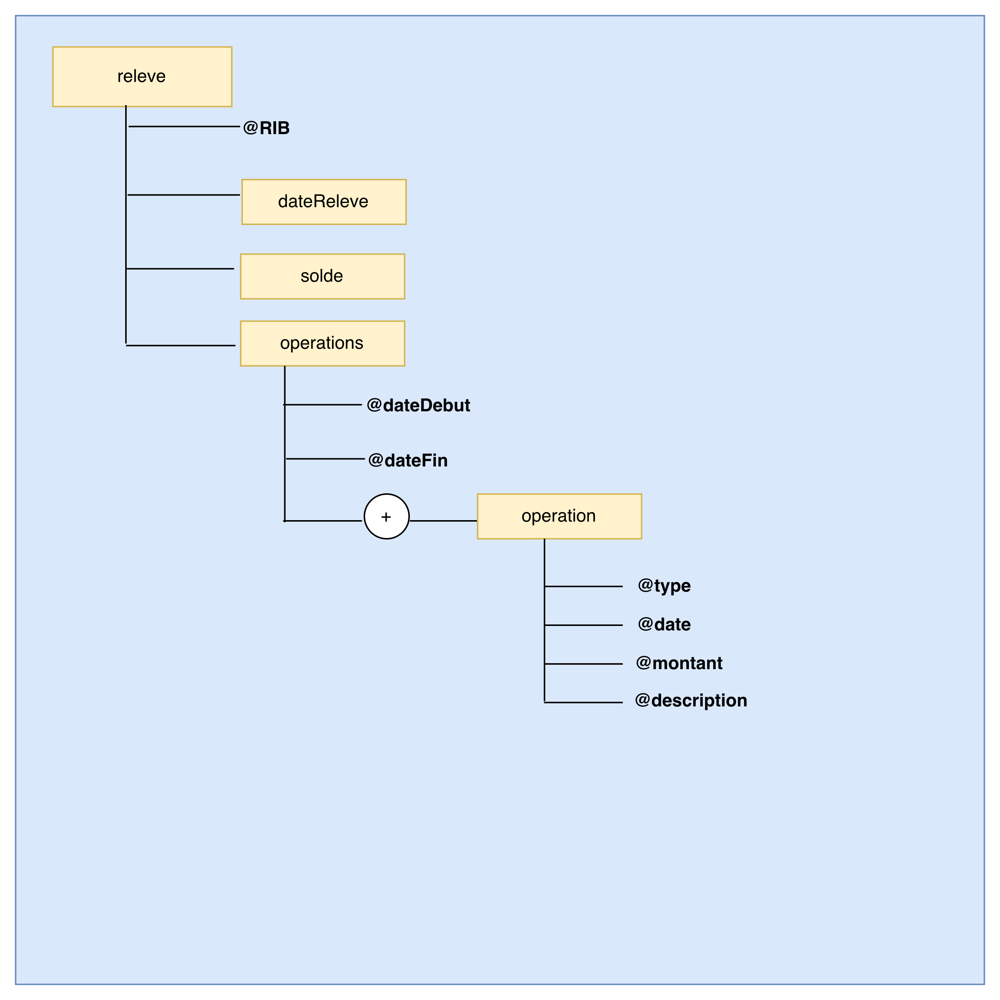

Voici une version **en anglais**, sans icônes ni emojis, avec un ton sobre et professionnel :

---

# Bank Statement Management — XML / DTD / XSD / XSL Project

This project demonstrates how XML technologies can be used to model and transform banking data, specifically bank operation statements.
It includes:

* An XML file describing banking operations
* A DTD and an XSD schema
* Two XSL transformations (standard and filtered versions)
* A graphic representation of the XML structure
* HTML outputs generated through XSLT

---

## Project Structure

```
.
├── operation.xml
├── operation.dtd
├── operation.xsd
├── operation.xsl
├── operation.html
├── operation-filtered.xml
├── operation-filtered.xsl
├── operation-filtered.html
└── static/
    ├── operation.architecture.png
    ├── operation.png
    └── operation-filtered.png
```

---

## 1. File Descriptions

### operation.xml

Contains the list of banking operations (date, label, amount, type, etc.).

### operation.dtd

Defines the basic structure and constraints of the XML document.

### operation.xsd

Provides a more advanced and strict validation schema for the XML data.

### operation.xsl

Standard XSL transformation used to generate an HTML page listing all operations.

### operation-filtered.xsl

Alternative transformation applying filtering rules (for example, filtering by type or by amount).

### operation.html

HTML output generated from `operation.xml` using `operation.xsl`.

### operation-filtered.html

HTML output generated from `operation-filtered.xml` using `operation-filtered.xsl`.

---

## 2. XML Structure Overview

The following image shows the graphical representation of the XML tree structure:

`static/operation.architecture.png`


---

## 3. Standard XSL Transformation

The standard transformation (`operation.xsl`) converts the main XML file into a complete HTML page showing all banking operations.

`static/operation.png`



---

## 4. Filtered XSL Transformation (XSD-Based)

Based on the XSD schema, a filtered XML file (`operation-filtered.xml`) is produced and then transformed using `operation-filtered.xsl`.

`static/operation-filtered.png`


---

## 5. How to Run the Transformations

### Using a web browser (simple method)

1. Open the XML file (`operation.xml` or `operation-filtered.xml`).
2. Ensure it contains an XSL processing instruction such as:

   ```xml
   <?xml-stylesheet type="text/xsl" href="operation.xsl"?>
   ```
3. Open the XML file in a browser that supports XSLT.

### Using an XSLT processor (XPath)

```bash
xsltproc operation.xsl operation.xml > operation.html
xsltproc operation-filtered.xsl operation-filtered.xml > operation-filtered.html
```

---

## Educational Objectives

* Understanding and using XML, DTD, XSD, and XSL
* Validating XML documents with different schema types
* Transforming structured data into HTML using XSLT
* Filtering and manipulating XML via XSL
* Visualizing XML document structures
